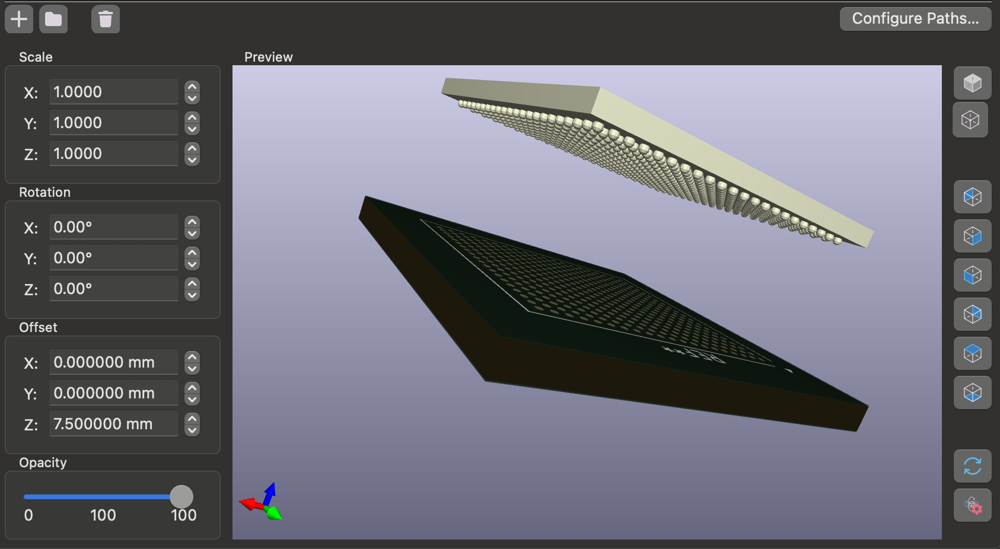

# stl2wrl - Convert an STL file to VRML/WRL

Useful for converting basic STL objects to Virtual Reality Modeling Language (VRML/WRL) files in KiCAD (or other programs).

## Example using a CLG400 footprint:
```
# 2.54 Scaling factor for mm/inch conversion
# Output is stored in demos/zynq_chip.wrl, ready to import into KiCAD
# Conversion may take ~30 seconds or longer for this model (Spec'd on M1 Macbook Air)
./stl2wrl.py demos/zynq_chip.stl 2.54
```

## KiCAD import



